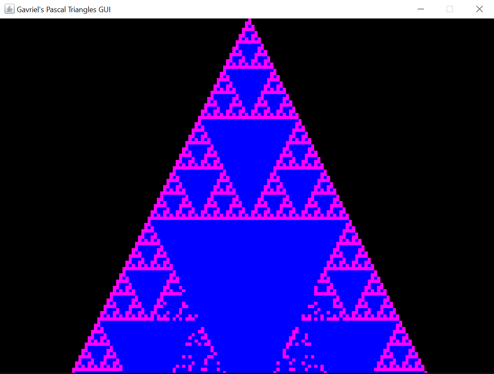

# Pascal
## Fractals using Pascle's triangle.
## Preview
### Mod 2


### Mod 4


### Mod 8


### Mod 16


________________________________________________________________

## Pascal's Triangle MOD 2 (Sierpinski Triangle)


________________________________________________________________

## Compilation To `.jar` And Running
### Windows
##### Option 1 - `.bat` Files
* Run `windows_compile.bat` to build and compile the code.
* Run `windows_run.bat` to run the `.jar` file.

### Linux
##### Option 1 - `.sh` Files
* Run `linux_compile.sh` to build and compile the code.
* Run `linux_run.sh` to run the `jar` file.

###### Instructions:
Make linux compile executable:

```bash
chmod +x ./linux_compile.sh
```

Run linux compile executable:

```bash
./linux_compile.sh
```

Make linux run executable:

```bash
chmod +x ./linux_run.sh
```

Run linux run executable:

```bash
./linux_run.sh
```

### Other OSs

________________________________________________________________
## Snapshots During Production

### First try


### Converting Int To Long


### Using The "Python" Like Modulo (For Handling Negative Numbers Too)
